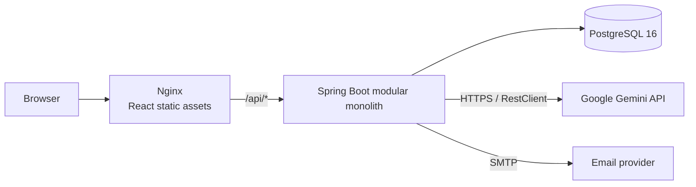

# SouthRail

**A production-oriented, full-stack railway reservation platform built as a Java/Spring Boot modular monolith with a React client.**

[](https://github.com/Sridhar0112/SouthRail/actions/workflows/backend-ci.yml)


SouthRail combines train discovery, multi-passenger booking, PNR lookup, cancellation and ticket generation with secure account workflows, administration, support tickets, audit records, email notifications and a Gemini-backed assistant. The backend exposes REST APIs secured with Spring Security and JWT; the React/Vite frontend is served by Nginx in the containerized deployment.

> If SouthRail is useful to you, consider starring the repository.

## Contents

- [Capabilities](#capabilities)
- [Architecture](#architecture)
- [Production engineering](#production-engineering)
- [Technology](#technology)
- [Quick start](#quick-start)
- [Testing](#testing)
- [Roadmap](#roadmap)
- [Contributing](#contributing)

## Capabilities

- **Accounts and authentication:** registration, email verification, access/refresh tokens, password reset, lockout/unlock, profile management and account deletion.
- **Rail travel:** station and train discovery, route-aware search and cached train reads.
- **Reservations:** booking review, passenger and seat allocation, PNR lookup, booking history, cancellation/refund estimates and PDF tickets.
- **Operations:** role-protected administration, support-ticket conversations, persisted notifications and audit-log access.
- **Assistance:** Google Gemini chat and model discovery through a provider-isolated AI service.

## Architecture

SouthRail is a **capability-oriented modular monolith**, not a microservices system. One Spring Boot deployment and one database contain cohesive packages for each business capability. This keeps related controllers, services, persistence and DTOs close together while preserving clear boundaries that can evolve without the operational cost of distributed services.



### Backend capabilities

| Package | Responsibility |
| --- | --- |
| `account` | User persistence, authenticated account lookup and profile lifecycle |
| `auth` | Login/registration, refresh and single-use account-token workflows |
| `booking` | Reservations, passengers, seat inventory, cancellation/refunds and PDF tickets |
| `train` | Stations, routes, schedules, search and train detail |
| `notification` | Persisted notifications and SMTP email delivery |
| `support` | Customer/admin support tickets and conversations |
| `admin` | Operational summaries and administrative read APIs |
| `audit` | Persisted security/operational audit events and admin retrieval |
| `ai` | Provider-neutral assistant service and Gemini adapter |

`shared` contains cross-cutting infrastructure rather than business capabilities: security/JWT, web errors, request correlation and logging, OpenAPI configuration, production configuration validation, and the base persistence entity.

## Production engineering

The repository currently implements:

- Explicit `local`, `test` and `prod` Spring profiles; production configuration validates required secrets and endpoints at startup.
- Stateless Spring Security with method/route RBAC, BCrypt passwords, signed JWT access tokens with issuer validation, and database-backed hashed refresh tokens with rotation/revocation.
- Authentication-time database checks for the current account's enabled and locked state, rather than trusting token claims alone.
- Validated request DTOs, centralized exception handling and a consistent API error envelope (including validation details and correlation ID).
- An `X-Correlation-ID` filter, MDC-enriched console logging and request completion/failure logging without request bodies or credentials.
- Explicit credentialed CORS origins; anonymous health probes; admin-only remaining Actuator routes; hidden health details and disabled Swagger/OpenAPI in production.
- Graceful shutdown with a 30-second shutdown phase and transaction boundaries around mutating booking, account, support and authentication workflows.
- Persisted audit events for security-sensitive actions.
- Bounded Gemini connect/read timeouts and translation of upstream failures into stable `502`/`503` API errors. Gemini uses Spring MVC's synchronous `RestClient`—not WebFlux.

## Technology

| Area | Verified stack |
| --- | --- |
| Backend | Java 21, Spring Boot 3.3.5, Spring MVC REST APIs, Spring Security, Spring Validation |
| Data | Spring Data JPA/Hibernate, PostgreSQL 16; H2 for tests |
| Security | JJWT 0.12.6, JWT access/refresh flow, BCrypt, RBAC |
| API/tooling | springdoc OpenAPI/Swagger UI, Actuator, OpenPDF, Spring Mail, Gemini via `RestClient` |
| Frontend | React 18, Vite 5, MUI 6, Redux Toolkit, Axios, React Router, React Hook Form, Zod |
| Delivery | Maven, npm, multi-stage Dockerfiles, Docker Compose, Nginx |

## Repository layout

```text
SouthRail/
├── backend/                 # Spring Boot modular monolith and backend tests
├── frontend/                # React/Vite single-page application
├── database/                # Ordered PostgreSQL initialization scripts
├── deploy/nginx/            # SPA hosting and /api reverse proxy
├── docs/                    # Deployment notes, audit and Postman collection
├── .github/                 # CI and collaboration templates
└── docker-compose.yml       # PostgreSQL, backend and frontend stack
```

## Quick start

### Docker Compose (recommended)

Requirements: Git and Docker with Compose v2.

```bash
git clone https://github.com/Sridhar0112/SouthRail.git
cd SouthRail
cp .env.example .env
# Replace every placeholder in .env; blank mail/Gemini credentials are not valid in prod.
docker compose up --build -d
```

The Compose frontend is available at <http://localhost:8088>. Nginx serves the SPA and proxies `/api/*` to the backend. The backend is also exposed directly at <http://localhost:8080/api>.

The ordered scripts in `database/` initialize a **new** `postgres-data` volume. They are not a migration system for an existing database; follow the controlled upgrade notes in [the deployment guide](docs/DEPLOYMENT.md).

Required Compose values are documented in [`.env.example`](.env.example): `DB_USERNAME`, `DB_PASSWORD`, `JWT_SECRET` (at least 32 characters), `CORS_ALLOWED_ORIGINS`, `APP_FRONTEND_URL`, `MAIL_FROM`, `MAIL_USERNAME`, `MAIL_PASSWORD`, and `GEMINI_API_KEY`.

### Local development

Start PostgreSQL and apply `database/001_schema.sql` through `database/005_booking_concurrency.sql` in numeric order, then run:

```bash
cd backend
SPRING_PROFILES_ACTIVE=local \
DB_URL=jdbc:postgresql://localhost:5432/southrail_new \
DB_USERNAME=southrail DB_PASSWORD=southrail \
mvn spring-boot:run
```

In another terminal:

```bash
cd frontend
npm ci
npm run dev
```

The development UI defaults to <http://localhost:5173>. All backend endpoints include the `/api` servlet context. With the local profile, Swagger UI is available at <http://localhost:8080/api/swagger-ui/index.html> (the configured `/swagger-ui.html` path redirects there). Swagger is deliberately disabled under `prod`.

See [`docs/DEPLOYMENT.md`](docs/DEPLOYMENT.md) for production variables, health probes, database lifecycle and hardening guidance. An importable API collection is available at [`docs/SouthRail.postman_collection.json`](docs/SouthRail.postman_collection.json).

## Testing

Backend tests use JUnit 5, Mockito, Spring MVC test support, Spring Security test utilities and an H2 database in PostgreSQL compatibility mode. Current coverage exercises:

- JWT/account lookup boundaries and production configuration validation;
- standardized web/security errors, validation and protected/public endpoint behavior;
- correlation-ID acceptance, generation and MDC cleanup;
- Gemini success parsing, model discovery, malformed responses and upstream failure mapping;
- entity/DTO foundation validation.

Run locally:

```bash
cd backend
mvn test
```

The [Backend CI workflow](.github/workflows/backend-ci.yml) is the durable source of build/test status. Frontend lint/build automation is intentionally left as a focused follow-up: the requested backend quality gate remains small, and the frontend currently has no automated test suite.

## Screenshots and demo

No genuine screenshots are committed yet. When preparing a public demo, capture real, populated application views (with synthetic accounts and no secrets) and place optimized WebP/PNG files in `docs/images/`:

1. train search results and availability;
2. booking review with multiple passengers;
3. user dashboard and ticket/PNR detail;
4. support conversation;
5. admin overview; and
6. light and dark responsive layouts.

## Roadmap

### Implemented now

- Modular-monolith capabilities, PostgreSQL persistence and transactional reservation/cancellation workflows.
- JWT access/refresh authentication, RBAC, account workflows, audit records and operational request tracing.
- Dockerized React/Nginx frontend, Spring Boot API, PostgreSQL, SMTP integration and Gemini assistance.

### Planned engineering phases

1. **Data lifecycle and integration testing:** convert ordered SQL to Flyway migrations and add PostgreSQL Testcontainers coverage.
2. **Reservation correctness at scale:** define inventory invariants; add optimistic or pessimistic database locking, concurrency tests and idempotency keys. Evaluate temporary Redis seat holds only after the database-first design is measured.
3. **Payments:** model an explicit payment state machine, provider callbacks, reconciliation and idempotent booking confirmation.
4. **Reliable async delivery:** introduce a transactional outbox before Kafka/event-driven email and notification consumers.
5. **Observability and performance:** publish selected Micrometer metrics to Prometheus/Grafana; add tracing, SLOs and booking/search load tests.
6. **Delivery:** add frontend quality gates, image/security scanning, managed secrets, repeatable migrations and staged deployment/rollback automation.

Planned items above are **not** presented as current functionality.

## Versioning and releases

The Maven and npm project files currently say `1.0.0`, but the repository has no Git tags and the roadmap still contains production-completeness work. The recommended first public semantic release is therefore **`v0.1.0`**; align package versions in a dedicated release commit rather than changing runtime artifacts as part of this documentation update. Draft notes are in [`CHANGELOG.md`](CHANGELOG.md).

## Contributing

Contributions are welcome. Read [`CONTRIBUTING.md`](CONTRIBUTING.md) before opening a change and use the issue templates for reproducible reports. Please keep capability boundaries intact and accompany behavior changes with tests.

## License

No open-source license file is currently present. Until the owner selects and adds a license, the source remains all rights reserved; viewing the repository does not grant reuse or redistribution rights.
